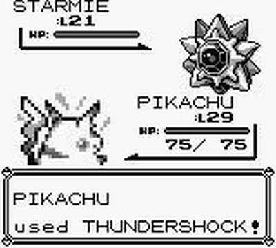
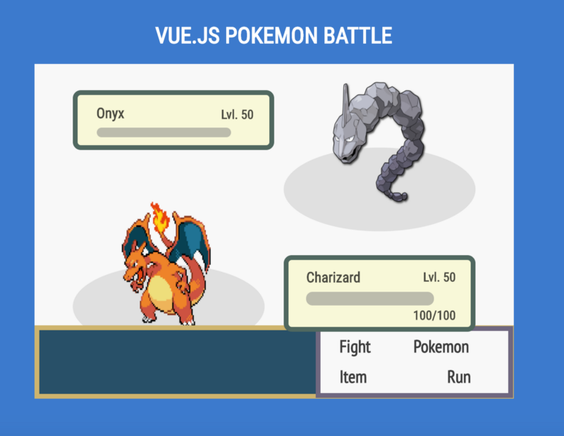

# Vue.js Pokemon Battle Tutorial
## vue.js神奇宝贝战斗教程


https://medium.com/coding-artist/vue-js-pokemon-battle-tutorial-380cd72eb681


接下来你将看见什么：一个使用Vue.js神奇宝贝战斗的详细制作过程。我很努力的不去做假设，但确实有很多东西需要经历（我光写这篇文章就花了15个小时）。如果你想学习更多的有关Vue.js的基础知识制作有趣的apps，你可以来看我的视频课程[Power Up With Pure CSS Images & Vue.js to Make Fun Apps](https://codingartist.io/pure-css-vue-js/).在这个课程中，我们会讨论更多有关Vue.js的基础细节问题。

查看全部源码: http://codepen.io/mikemang/pen/zNJZYg/
查看在线demo: http://codepen.io/mikemang/live/zNJZYg


## Introduction

从学习毕业之后，我决定我要致力于web开发。我很快意识到，我需要更加具体的关注我想要集中的web开发技能。

有一定的经验之后，我终于在前端特别是偏设计方面找到了兴趣。相比于制作动态web应用，我更喜欢一些小的应用，比如Mad Libs，Connect 4等等.

虽然有可能这不合你的胃口，但是我认为制作有趣的，小型的web apps是一个学习新框架的好方法。在尝试了React和Vue.js之后，我疯狂的爱上了Vue提供的可读性和易用性，特别是对于像我这样的人来说（翻译的不准确）。

然而，无论是React还是Vue.js，都有非常多的制作我喜欢的那种有趣的小巧的web应用教程。所以，我认为写一篇超级详细的用vue.js制作神奇宝贝战斗是一件非常酷的事情。

如果你还没有读过我上一篇博客，我不喜欢做假设并且我确实很喜欢把事情分解。无论这是你的Vue.js的第一篇介绍还是你只是想找些与众不同的，我希望你能享受这篇博文。

## 分解开来

在我开始之前，先把我们要做什么分解下。

首先，我们由一个[template](https://codepen.io/mikemang/pen/rjKaGW)开始，这个template就是我们神奇宝贝战斗app的container。快去fork。

我不会详细说明我如何码出这个的。如果你不熟悉纯css图像并好奇我如何做到的，我建议你读我的另一篇博文[Beginner’s Guide to Pure CSS Images.](https://medium.com/coding-artist/a-beginners-guide-to-pure-css-images-ef9a5d069dd2)

有了这个template之后，我们需要添加以下东西：

1. 两个神奇宝贝的图片
2. 名字，等级和每个神奇宝贝的HP
3. 战斗中的选项将会放在右下角的白盒子中
4. 战斗中的文字更新将会放在战斗选项的左边

就功能性来说，我们需要做以下几点：

1. 允许使用者用他们的神奇宝贝攻击对方的神奇宝贝并造成伤害
2. 使用者的神奇宝贝攻击完了之后，对方的也可以攻击使用者的并造成伤害
3. 如果没有神奇宝贝昏厥的话继续战斗，如果有的话则停止战斗
4. 在战斗的过程中更新战斗信息
5. 一场战斗结束后允许启动一场新的战斗

## 将模板填满

首先，我们看看我们有什么。

在我们的html中，有一个先前提过的纯CSS图片和一个标题。所有的这些都都被包围在下面的代码里面:

```
<div id="app">
//rest of code
</div>
```
这个包围其实是一个Vue.js实例。我们来看一下。
```
var app = new Vue({
    el: '#app',
        data: {
    },
    methods:{

    }
})
```

这是一个基本的Vue.js实例的壳。el通过html中的`<div id=”app”></div>`和这个实例联系。因为有这个联系，我们可以在*data:{}*中有一些可以使用在html中的数据。

我们可以操作这些数据，所以这些数据可以通过*methods: {}*内的函数变为动态的。这些方法可以被各种的事件处理函数调用。

那么我们开始，让我们来回顾下我们需要加到模板中的东西，并且把它添加到那个我们称之为app的Vue.js实例的data中去.

在模板中，我们需要添加以下的东西：

1. 两个神奇宝贝的图片
2. 每个神奇宝贝的名字，等级，血量
3. 右下角角落的白盒中的战斗选项
4. 战斗选项白盒左边的战斗信息

我们想要和以下图片相似的东西。



## 将数据添加到实例中

那么。。我们可以像下面这样添加一些数据到我们的Vue.js实例中去:
```
var app = new Vue({
    el: '#app',
    data: {
        userPokemonSrc: "http://guidesmedia.ign.com/guides/059687/images/blackwhite/pokemans_006.gif",
        opponentPokemonSrc: "http://pre01.deviantart.net/959a/th/pre/f/2016/075/4/6/095_onix_by_rayo123000-d9vbjj3.png",
        userPokemon: "Charizard",
        opponentPokemon: "Onyx",
        userHP: 100,
        opponentHP: 100,
        userLevel: 50,
        opponentLevel: 50,
        battleText: "What will Charizard do?",
        battleOptions: ["Fight", "Pokemon", "Item", "Run"]
    },
    methods:{

    }
})
```
这里我们为两个神奇宝贝指定路径
```
data: {
     userPokemonSrc: "http://guidesmedia.ign.com/guides/059687/images/blackwhite/pokemans_006.gif",
     opponentPokemonSrc: "http://pre01.deviantart.net/959a/th/pre/f/2016/075/4/6/095_onix_by_rayo123000-d9vbjj3.png",
     //other stuff
}
```
我们也为两个神奇宝贝起个名字
```
data: {
     userPokemonSrc: "http://guidesmedia.ign.com/guides/059687/images/blackwhite/pokemans_006.gif",
     opponentPokemonSrc: "http://pre01.deviantart.net/959a/th/pre/f/2016/075/4/6/095_onix_by_rayo123000-d9vbjj3.png",
     userPokemon: "Charizard",
     opponentPokemon: "Onyx",
     //other stuff
}
```
接下来，我们也像这样添加添加了血量和等级
```
data: {
     userPokemonSrc: "http://guidesmedia.ign.com/guides/059687/images/blackwhite/pokemans_006.gif",
     opponentPokemonSrc: "http://pre01.deviantart.net/959a/th/pre/f/2016/075/4/6/095_onix_by_rayo123000-d9vbjj3.png",
     userPokemon: "Charizard",
     opponentPokemon: "Onyx",
     userHP: 100,
     opponentHP: 100,
     userLevel: 50,
     opponentLevel: 50,
     //other stuff
}
```
最后，我们添加了一个默认的战斗信息的字符串和一个我们战斗选项的数组:
```
var app = new Vue({
    el: '#app',
    data: {
        userPokemonSrc: "http://guidesmedia.ign.com/guides/059687/images/blackwhite/pokemans_006.gif",
        opponentPokemonSrc: "http://pre01.deviantart.net/959a/th/pre/f/2016/075/4/6/095_onix_by_rayo123000-d9vbjj3.png",
        userPokemon: "Charizard",
        opponentPokemon: "Onyx",
        userHP: 100,
        opponentHP: 100,
        userLevel: 50,
        opponentLevel: 50,
        battleText: "What will Charizard do?",
        battleOptions: ["Fight", "Pokemon", "Item", "Run"]
    },
    methods:{

    }
})
```

很好

现在我们需要把这些数据插入到html之中，这样我们才能看到：

```
<body>
<div id="app">
    <h1 class="title">Vue.js Pokemon Battle</h1>
 <!-- Begin battle scene -->
 <div class="battle-scene">
   <div class="box-top-left">
     <h2 class="pokemon">{{opponentPokemon}}</h2>
     <div class="hp-bar-top">
       <div class="hp-bar-fill"></div>
     </div>
     <h4 class="level">Lvl. {{opponentLevel}}</h4>
   </div>
   <div class="box-top-right">
     
   </div>
    <div class="box-bottom-left">
      
   </div>
   <div class="box-bottom-right">
      <h2 class="pokemon">{{userPokemon}}</h2>
     <div class="hp-bar-bottom">
       <div class="hp-bar-fill"></div>
     </div>
     <h4 class="level">Lvl. {{userLevel}}</h4>
     <h4 class="hp">{{userHP}}/{{userHP}}</h4>
   </div>
   <div class="bottom-menu">
     <div class="battle-text text-box-left">{{battleText}}</div>
       <div class="text-box-right">
         <h4 class="battle-text-top-left">{{battleOptions[0]}}</h4>
         <h4 class="battle-text-top-right">{{battleOptions[1]}}</h4>
         <h4 class="battle-text-bottom-left">{{battleOptions[2]}}      </h4>
         <h4 class="battle-text-bottom-right">{{battleOptions[3]}}</h4> 
     </div>
   </div>
   
 
 </div> 
  <!-- end battle scene -->
 </div>
</body>
```
到这里，我们应该会得到:<br>  


是不是很酷?

那好，我们来讨论下它是怎么工作的。

## 插入数据

当我们需要在一些html标签中插入数据的时候，我们只需要像下面这样使用{{[数据的名字]}}:

```
<h2 class="pokemon">{{opponentPokemon}}</h2>
<h4 class="level">Lvl. {{opponentLevel}}</h4>
<h2 class="pokemon">{{userPokemon}}</h2>
<h4 class="level">Lvl. {{userLevel}}</h4>
<h4 class="hp">{{userHP}}/{{userHP}}</h4>
<div class="battle-text text-box-left">{{battleText}}</div>
//we also can do arrays like so
<h4 class="battle-text-top-left">{{battleOptions[0]}}</h4>
<h4 class="battle-text-top-right">{{battleOptions[1]}}</h4>
<h4 class="battle-text-bottom-left">{{battleOptions[2]}}</h4>
<h4 class="battle-text-bottom-right">{{battleOptions[3]}}</h4>
```

任何双括号之间的东西都会输出那个叫app的Vue.js实例中储存的数据。你可以看到，我们也可以在插入数据的周围添加字符串。

现在，我们的图像被我们的Vue.js实例用一种不同的方式控制。我们的数据中有用于两个不同图像标签的src的图片链接。因为我们想在一个标签中绑定一个东西，我们可以使用v-bind:[what we want to bind] = “[name of some data]” ，对我们来说就是:
```


```


## 样式绑定

知道了以上之后，我们也可以绑定一个html标签的样式。我们将用这种做法去填满我们用纯css写的血条。

我们为我们的神奇宝贝和对方的神奇宝贝添加血条
```
<body>
<div id="app">
    <h1 class="title">Vue.js Pokemon Battle</h1>
 <!-- Begin battle scene -->
 <div class="battle-scene">
   <div class="box-top-left">
     <h2 class="pokemon">{{opponentPokemon}}</h2>
     <div class="hp-bar-top">
       <div v-bind:style="opponentHpBar" class="hp-bar-fill"></div>
     </div>
     <h4 class="level">Lvl. {{opponentLevel}}</h4>
   </div>
   <div class="box-top-right">
     
   </div>
    <div class="box-bottom-left">
      
   </div>
   <div class="box-bottom-right">
      <h2 class="pokemon"> {{userPokemon}}</h2>
     <div class="hp-bar-bottom">
       <div v-bind:style="userHpBar" class="hp-bar-fill"></div>
     </div>
     <h4 class="level">Lvl. {{userLevel}}</h4>
     <h4 class="hp">{{userHP}}/{{userHP}}</h4>
   </div>
   <div class="bottom-menu">
     <div class="battle-text text-box-left">
       {{battleText}}
     </div>
       <div class="text-box-right">
         <h4 class="battle-text-top-left">{{battleOptions[0]}}</h4>
         <h4 class="battle-text-top-right">{{battleOptions[1]}}</h4>
         <h4 class="battle-text-bottom-left">{{battleOptions[2]}}</h4>
         <h4 class="battle-text-bottom-right">{{battleOptions[3]}}</h4>   
     </div>
   </div>
   
 
 </div> 
  <!-- end battle scene -->
 </div>
</body>
```


看看我们都加了什么:

```
<div v-bind:style="opponentHpBar" class="hp-bar-fill"></div>
<div v-bind:style="userHpBar" class="hp-bar-fill"></div>
//our CSS
.hp-bar-fill{
  position: absolute;
  height: 100%;
  border-radius: 20px;
  background: #FF8800;
}
```

你可以看到我们往一个类名叫做.hp-bar-fill的标签上加入了一行v-bind:style。这个类名上有一个橘色(#ff800)并且没有设宽度。因为没有宽度，我们没有看到一个橘色的条。

如果我们随便加一个宽，像60%，我们就可以看到橘色的条了。

```
.hp-bar-fill{
  position: absolute;
  height: 100%;
  width: 60%;
  border-radius: 20px;
  background: #FF8800;
}
```


我们来思考下血条是怎么工作的

当一个神奇宝贝被攻击的时候，血条应该更新。因此，我们需要动态的控制血条的宽度。我们也需要考虑到每一个神奇宝贝的血条是不一样长的。

所以我们加入了v-bind:style=”opponentHpBar” and v-bind:style=”userHpBar”这一行.有了前面这一行，我们可以通过控制我们Vue实例的data来控制血条。我们可以明确的相应控制我们的神奇宝贝和对方的神奇宝贝。同样重要的一点是，Vuejs只控制我们指定的样式。

现在我们的Vue实例中没有任何数据叫做opponentHpBar或者userHPBar。

那我们来编辑下Vue实例的数据：
```
var app = new Vue({
  el: '#app',
  data: {
     userPokemonSrc: "http://guidesmedia.ign.com/guides/059687/images/blackwhite/pokemans_006.gif",
     opponentPokemonSrc: "http://pre01.deviantart.net/959a/th/pre/f/2016/075/4/6/095_onix_by_rayo123000-d9vbjj3.png",
     userPokemon: "Charizard",
     opponentPokemon: "Onyx",
     userHP: 100,
     opponentHP: 100,
     userLevel: 50,
     opponentLevel: 50,
     battleText: "What will Charizard do?",
     battleOptions: ["Fight", "Pokemon", "Item", "Run"],
  userHpBar: {
    width: "100%"
  },
  opponentHpBar: {
    width: "100%"
  }
 },
  methods:{
    
  }
  
})
```


棒极了！现在我们的血条可以通过下面的语法被vue实例控制：
```
//within data: {...}
 [data name referenced in v-bind:style]: {
    [CSS value to control]: "[value]"
  }
//in our case
userHpBar: {
    width: "100%"
  },
opponentHpBar: {
    width: "100%"
}
```

好！我们现在把我们的模板填充完毕，并且学到了关于Vue.js的事情，接下来我们来控制数据让他动起来

# 控制我们的数据

首先，先来回顾下我们需要的功能。

就功能来说，我们需要做下面几点：

1. 允许用户能够用他的神奇宝贝攻击对方的神奇宝贝并造成损伤。
2. 在己方的神奇宝贝攻击完后对方的神奇宝贝会攻击并造成损伤。
3. 没有神奇宝贝晕倒则继续游戏，如果有则停止游戏。
4. 在过程中更新战斗信息和战斗选项。
5. 当一个战斗结束之后允许新开一个战斗。

我不会按照这个列表的顺序来写代码，我会从最简单的写到最有挑战性的。首先从第四条开始。

我们的战斗信息会根据战斗选项的选择而更新，所以我们先来做战斗选项：


当这个教程结束的时候，非常推荐你添加别的功能，但现在除了战斗，我不会添加别的功能(这篇博客已经需要花费六个小时了)。

所以我们先来做“pokemon”，“Item”或者“Run”被点击的时候更新战斗信息。

无论哪个选项被点击了，我们都会调用一个在methods函数（processOption）。我们先来写函数的壳：
```
methods:{
    processOption: function(){
      
    }   
}
```
然后我们需要通过一个事件处理器调用这个函数。

我们会像这样使用事件处理器:
```
<h4 v-on:click="processOption" class="battle-text-top-left">{{battleOptions[0]}}</h4>
<h4 v-on:click="processOption" class="battle-text-top-right">{{battleOptions[1]}}</h4>
<h4 v-on:click="processOption" class="battle-text-bottom-left">{{battleOptions[2]}}</h4>
<h4 v-on:click="processOption" class="battle-text-bottom-right">{{battleOptions[3]}}</h4>
```
事件处理器语法如下：
```
v-on:[event]="[function name found in methods]"
```
所以当任何一个选项被点击了，现在暂时什么都没有processOption就会被触发。

在processOption中，我们需要根据哪个选项被点击去控制数据。所以，我们需要像下面这样为我们的函数加一个参数：
```
methods:{
  processOption: function(option){
    
  }   
}
```
接下来我们传一个参数，这样我们的函数就知道哪一个选项被点击了，我们也可以相应的更新我们的战斗信息.
```
<h4 v-on:click="processOption(1)" class="battle-text-top-left">{{battleOptions[0]}}</h4>
<h4 v-on:click="processOption(2)" class="battle-text-top-right">{{battleOptions[1]}}</h4>
<h4 v-on:click="processOption(3)" class="battle-text-bottom-left">{{battleOptions[2]}}</h4>
<h4 v-on:click="processOption(4)" class="battle-text-bottom-right">{{battleOptions[3]}}</h4>
```
下一步，我们更新我们的函数去控制这些选项：
```
methods:{
    processOption: function(option){
      switch(option){
        case 1:
          //handle fight, will be done later
        break;
        case 2:
          //handle pokemon
        break;
        case 3:
          //handle item
        break;
        case 4:
          //handle run
        break;
      }
    }   
  }
```
接下来，我们来处理2-4的情况去更新战斗信息：
```
methods:{
    processOption: function(option){
      switch(option){
        case 1:
          //handle fight
        break;
        case 2:
          //handle pokemon
          this.battleText = "You're our only hope " + this.userPokemon + "!"
        break;
        case 3:
          //handle item
          this.battleText = "No items in bag."
        break;
        case 4:
          //handle run
          this.battleText = "Can't escape."
        break;
      }
    }   
  }
```
现在，当我们点击"Pokemon","Item"或者"run"的时候，我们可以看见战斗信息的更新：

在这里我们this来获得我们的data。我们也可以用Vue实例的名字来获取其他Vue实例的data（也就是说，app.battleText而不是this.battleText）.

你可以看到，用Vue控制数据非常容易。

在我们进到下一步之前，我们先做个小修改。我们需要这些具体的战斗信息显示一段时间后又变成我们的默认信息。因此，我们加入setTimeout。（注意：从现在开始，在点击另外一个选项的时候你需要等下战斗信息更新）
```
methods:{
  processOption: function(option){
    switch(option){
      case 1:
        //handle fight
      break;
      case 2:
        //handle pokemon
        setTimeout(() => {
        this.battleText = "What will " + this.userPokemon + " do?"
    }, 2000);
        
        this.battleText = "You're our only hope " + this.userPokemon + "!"
        
      break;
      case 3:
        //handle item
        setTimeout(() => {
        this.battleText = "What will " + this.userPokemon + " do?"
    }, 2000);
        this.battleText = "No items in bag."
      break;
      case 4:
        //handle run
        setTimeout(() => {
        this.battleText = "What will " + this.userPokemon + " do?"
    }, 2000);
        this.battleText = "Can't escape."
      break;
    }
  }
```
通过使用setTimeout,在变回原来的默认信息“What will [Charizard] do?”之前会显示两秒的更新后的战斗信息。

测试下上面的效果，当你测试完了之后，接下来去处理更加复杂的战斗选项。

让我们先思考下。当你点击战斗按钮的时候，我们希望用可能的攻击选项来代替战斗中的选项。战斗选项被储存在一个数组中。选项的数量有几个。

我们有两种想选择a）用不同的选项重写数组b）加入一个不活跃的新的fightOptions数组，当战斗选项被选择的时候battleOptions变的不活跃而fightOptions变的活跃。

vue.js有很好的控制元素开启关闭的方式，所以，我们选择第二种方式。

首先我们在data中加入一个叫做fightOptions的数组：
```
data: {
//...
fightOptions: ["Scratch", "Fly", "Flamethrower", "Ember"]
//...
}
```
接下来，我们把攻击(fightOptions的值)加入我们的html
```
<div class="text-box-right">
//battleOptions
<h4 v-on:click="processOption(1)" class="battle-text-top-left">{{battleOptions[0]}}</h4>
<h4 v-on:click="processOption(2)" class="battle-text-top-right">{{battleOptions[1]}}</h4>
<h4 v-on:click="processOption(3)" class="battle-text-bottom-left">{{battleOptions[2]}}</h4>
<h4 v-on:click="processOption(4)" class="battle-text-bottom-right">{{battleOptions[3]}}</h4>
//fightOptions
<h4 v-on:click="processOption(1)" class="battle-text-top-left">{{fightOptions[0]}}</h4>
<h4 v-on:click="processOption(2)" class="battle-text-top-right">{{fightOptions[1]}}</h4>
<h4 v-on:click="processOption(3)" class="battle-text-bottom-left">{{fightOptions[2]}}</h4>
<h4 v-on:click="processOption(4)" class="battle-text-bottom-right">{{fightOptions[3]}}</h4> 
         
</div>
```
下一步，把battleOptions和fightOptions都用一个简单的父div包裹起来。
```
<div class="text-box-right">
//battleOptions
<div id="battleOptions">
<h4 v-on:click="processOption(1)" class="battle-text-top-left">{{battleOptions[0]}}</h4>
<h4 v-on:click="processOption(2)" class="battle-text-top-right">{{battleOptions[1]}}</h4>
<h4 v-on:click="processOption(3)" class="battle-text-bottom-left">{{battleOptions[2]}}</h4>
<h4 v-on:click="processOption(4)" class="battle-text-bottom-right">{{battleOptions[3]}}</h4>
</div>
//fightOptions
<div id="fightOptions">
<h4 v-on:click="processOption(1)" class="battle-text-top-left">{{fightOptions[0]}}</h4>
<h4 v-on:click="processOption(2)" class="battle-text-top-right">{{fightOptions[1]}}</h4>
<h4 v-on:click="processOption(3)" class="battle-text-bottom-left">{{fightOptions[2]}}</h4>
<h4 v-on:click="processOption(4)" class="battle-text-bottom-right">{{fightOptions[3]}}</h4>
</div>
         
</div>
```
这时候，两个选项将会重叠。

<!-- 图片占位 -->

直到点击fight按钮之前，我们都需要保持fightOptions处于不激活状态，而battleOptions处于激活状态。

所以我们加入一些v-if来进行控制。

```
<div v-if="optionsOn" id="battleOptions">
<h4 v-on:click="processOption(1)" class="battle-text-top-left">{{battleOptions[0]}}</h4>
<h4 v-on:click="processOption(2)" class="battle-text-top-right">{{battleOptions[1]}}</h4>
<h4 v-on:click="processOption(3)" class="battle-text-bottom-left">{{battleOptions[2]}}</h4>
<h4 v-on:click="processOption(4)" class="battle-text-bottom-right">{{battleOptions[3]}}</h4>
</div>
//fightOptions
<div v-if="fightOn" id="fightOptions">
<h4 v-on:click="processOption(1)" class="battle-text-top-left">{{fightOptions[0]}}</h4>
<h4 v-on:click="processOption(2)" class="battle-text-top-right">{{fightOptions[1]}}</h4>
<h4 v-on:click="processOption(3)" class="battle-text-bottom-left">{{fightOptions[2]}}</h4>
<h4 v-on:click="processOption(4)" class="battle-text-bottom-right">{{fightOptions[3]}}</h4>
</div>
         
</div>
```
optionsOn和fightOn是由Vue实例中的data中的名字引用而来，并被设置为true或者false。如果值是true，就会被激活并渲染。如果值是false，就不会被渲染。

所以我们将下面的代码加入Vue实例

```
data: {
//....
fightOn: false,
optionsOn: true,
//...
}
```
在默认状态下，battleOptions将会被渲染因为optionsOn被设置为true而fightOptions将不会被渲染因为fightOn被设为false。

我们现在可以在页面上看到效果。

<!-- 图片占位 -->


